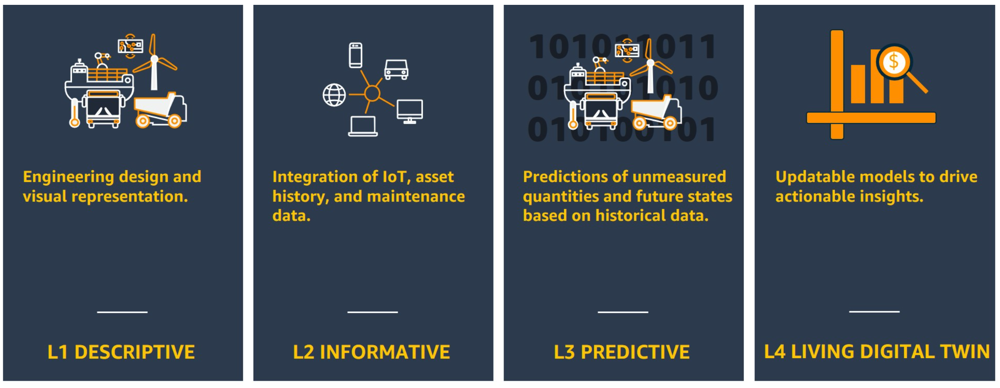
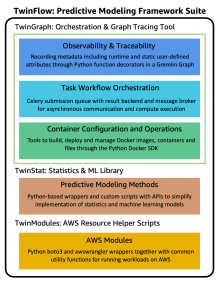

# TwinFlow

## Purpose 

We’ve written [a blog that describes example use cases](https://aws.amazon.com/blogs/hpc/predictive-models-and-simulations-with-twinflow-on-aws/) including engineering design optimization, scenario analysis, systems-of-systems analysis, and L3/L4 digital twins. TwinFlow provides a unified framework that enables:

* registering different types of predictive models (inductive: data-driven, deductive: simulation, hybrid)
* task orchestration via graphs
* versioning and traceability
* workflow deployment on a scalable compute infrastructure
* mechanisms for self-learning (i.e. run triggers to rerun training and building of predictive models, update model parameters using probabilistic methods)

<center>
</center>
<p align="center">Figure 1: Overview of TwinFlow.</p>


[TwinGraph](https://github.com/aws-samples/twingraph) is the core of Twin
flow, allowing for scalable graph orchestration of containerized compute tasks. A key differentiator of TwinGraph is the ability to use a number of different containers running on different heterogeneous compute nodes, chained within a dynamic workflow directed-acyclic graph  (DAG) in an asynchronous event-driven architecture. Additionally, TwinGraph saves all the required (customizable) artifacts within a scalable graph database such as Amazon Neptune or Apache TinkerGraph.

TwinFlow relies on [TwinStat](https://github.com/aws-samples/twinstat) for inductive data-driven predictive modelling, including probabilistic methods for updating model parameters. Other types of predictive models, most notably deductive simulations, must be supplied from external sources (i.e. partners or customers).

[TwinModules](https://github.com/aws-samples/twinmodules) is the automation that provides python wrappers to AWS tasks, compute and workflow orchestration, and traceability. Users can insert predictive models anywhere within the graph orchestration to complete the L4 DT.

TwinFlow is designed to help create Digital Twins. In prior [work](https://aws.amazon.com/blogs/iot/digital-twins-on-aws-unlocking-business-value-and-outcomes/), we have described different categories of DTs. These include [L1 (descriptive)](https://aws.amazon.com/blogs/iot/l1-descriptive-digital-twins/), [L2 (informative)](https://aws.amazon.com/blogs/iot/l2-informative-digital-twins/), [L3 (predictive)](https://aws.amazon.com/blogs/iot/l3-predictive-digital-twins/), and [L4 (living)](https://aws.amazon.com/blogs/iot/l4-living-digital-twins/), which is the focus of this work. This is shown in Figure 2.

<center>
</center>
<p align="center">Figure 2: Leveling Framework for Digital Twins.</p>

A level 4 (L4) digital twin (DT) requires the ability to retrain or rebuild any predictive models that are utilized in the digital twin. Predictive models can either be inductive (data-driven: statistical, ML/DL), deductive (first principle-based, spatial simulations), or a hybrid combination. Most companies that utilize L4 DTs write custom code for each application. TwinFlow provides tools to minimize the undifferentiated heavy lifting of building L4 DTs and allows users to focus on the code custom to their use case. Figure 3 shows where the different submodules of TwinFlow (TwinGraph, TwinStat & TwinModules) piece together to form an L4 DT solution.

<center><p align="center">
</p></center>
<p align="center">Figure 3: Overall Architecture of TwinFlow for Digital Twins.</p>


## Instructions

When the TwinFlow project is cloned, the three modules will appear as empty folders.
```bash
git clone https://github.com/aws-samples/twinflow.git
```

In order to use the submodules, you must run two commands:
* git submodule init to initialize local configuration file:

    ```bash
    git submodule init
    ```

* git submodule update to fetch all the data from that project and check out the appropriate commit listed in TwinFlow:

    ```bash
    git submodule update
    ```
Alternatively, if you only wish to clone the repo once and have the current commit HEAD of the submodules cloned recursively, you can use:

```bash
git clone --recursive https://github.com/aws-samples/twinflow.git
```

## Security

See [CONTRIBUTING](CONTRIBUTING.md#security-issue-notifications) for more information.

## License

This library is licensed under the MIT-0 License. See the LICENSE file.

## References

* [TwinFlow Overview & Use Cases](https://aws.amazon.com/blogs/hpc/predictive-models-and-simulations-with-twinflow-on-aws//)
* [Digital Twins Leveling Framework](https://aws.amazon.com/blogs/iot/digital-twins-on-aws-unlocking-business-value-and-outcomes/)
* [Level 1 Descriptive DT Overview](https://aws.amazon.com/blogs/iot/l1-descriptive-digital-twins/)
* [Level 2 Informative DT Overview](https://aws.amazon.com/blogs/iot/l2-informative-digital-twins/)
* [Level 3 Predictive DT Overview](https://aws.amazon.com/blogs/iot/l3-predictive-digital-twins/)
* [Level 4 Living DT Overview](https://aws.amazon.com/blogs/iot/l4-living-digital-twins/)
* AWS Do-PM Framework: Parts [1](https://aws.amazon.com/blogs/hpc/building-a-scalable-predictive-modeling-framework-in-aws/), [2](https://aws.amazon.com/blogs/hpc/building-a-scalable-predictive-modeling-framework-in-aws-part-2/), [3](https://aws.amazon.com/blogs/hpc/building-a-scalable-predictive-modeling-framework-in-aws-part-3/)
* [Level 3 Digital Twin Virtual Sensors with Ansys on AWS](https://aws.amazon.com/blogs/hpc/deploying-a-level-3-digital-twin-virtual-sensor-with-ansys-on-aws/)


## Credits

This open source framework was developed by the Autonomous Computing Team within Amazon Web Services (AWS) Worldwide Specialist Organization (WWSO). Developers include Ross Pivovar, Vidyasagar Ananthan, Satheesh Maheswaran, and Cheryl Abundo. Authors would like to thank Alex Iankoulski for his detailed guidance and expertise in reviewing the code.
